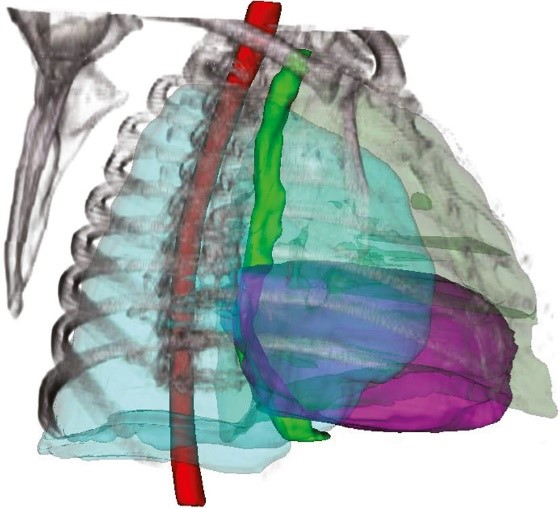
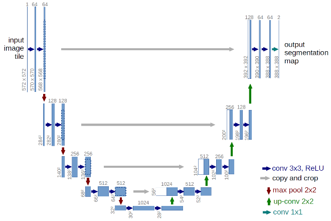
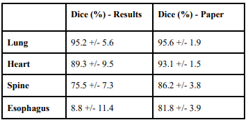

[![Contributors][contributors-shield]][contributors-url]
[![LinkedIn][linkedin-shield]][linkedin-url]


<!-- PROJECT LOGO -->
<br />
<p align="center">
  <a href="https://github.com/Karndeep-UCSD/U-Net-Architecture-for-Thoracic-Organ-Segmentation">
    
  </a>

  <h3 align="center">U-Net Architecture for Thoracic Organ Segmentation</h3>

  <p align="center">
    Annotation of Computed Tomography(CT) Scans is a tedious process where a radiologist manually combs through a volume of images marking individual pixel that contain an organ of interest. In this project, we seek to automate the process of segmenting organs in CT scans with deep learning. The U-Net architecture is implemented in tensorflow and trained to autonomously segment the heart, lungs, spine, and esophagus from a thoracic CT scans. 
  </p>
</p>


<!-- TABLE OF CONTENTS -->
<details open="open">
  <summary>Table of Contents</summary>
  <ol>
    <li><a href="#project-overview">Project Overview</a></li>
    <li><a href="#prerequisites">Prerequisites</a></li>
    <li><a href="#data-availability">Data Availability</a></li>
    <li><a href="#usage">Usage</a></li>
    <li><a href="#results">Results</a></li>
    <li><a href="#contact">Contact</a></li>
  </ol>
</details>


<!-- PROJECT OVERVIEW -->
## Project Overview
<p>
  This project demonstrates the use of machine learning approaches to auto-segment organs present in computed tomography (CT) scans of the human thoracic region. Segmenting organs such as the lung, spine, heart, and esophagus are important for early detection of organs-at-risk (OARs), however the conventional segmentation process is labor and time intensive (manual contouring of CT slices, usually taking 1-2 hours) and is subject to human error and bias. 
</p>

<br />
<p align="center">
  
</p>

<p>  
  The U-Net is a Convolutional Network designed specifically for biomedical image segmentation. An image is input into the network. The network outputs a binary mask corresponding to the region of interest. The network architecture resembles that of an autoencoder, consisting of a contracting path, a bottleneck, and an expanding path. Skip connections connect blocks in the contractile path to corresponding layers in the expanding path, preserving spatial information. Dropout layers were included in the model to improve generalization. This is coupled to a binary cross entropy loss. For training, the Adam optimizer was used. Due to the kernel size used for each of the 23 convolutional layers, the model is only able to accurately predict information in the central two thirds of the image. This is due to a loss of information at the edges of the matrix with every convolution.
</p>

<p>
  This method was inspired by result of the Thoracic Auto-Segmentation Challenge organized at the 2017 Annual Meeting of American Association of Physicists on Medicine. (AAPM) Using the benchmark dataset and accuracy criteria provided by this challenge, we were able to reproduce the following organ segmentation accuracy with our model.
</p>

<br />
<p align="center">
  
</p>


### Prerequisites
This repository uses function from the following Python libraries.

* tensorflow
* numpy
* sklearn
* skimage
* pydicom
* matplotlib
* os
* glob
* random

### Data Availability
<p>
  
  Data can be downloaded from: [DataSet]( https://wiki.cancerimagingarchive.net/display/Public/Lung+CT+Segmentation+Challenge+2017). Data is stored in following file structure:
  
</p>

<p align="center">
   NBIA_CT_Data > [Patient Data Folders] > A Single Folder > [Dicom folder, segmentation folder] > Dicom files
</p>
  
  
## Usage

1. Generate Labels
  ```sh
  Generate_Labels.py
  ```
  This function serves to preprocess our the data provided by the AAMP competition. Dicom segmentation files are taken and converted to 3D binary masks, one per organ, and saved as npy files. CT dicoms are preprocessed and saved volumetrically as .npy files.
  
2. Convert 3D volumes to set of 2D images for training
  ```sh
  3d_2d_conversion.ipynb
  ```
  This function takes the 3D npy files made by Generate_Labels.py and generates 512x512 2D slices. They are saved as individual .npy files. It first does this for the CT volumes, then for the individual organ segmentations. Organ slices are saved to an organ specific folder.
  
3. Training and Testing 2D Model
  ```sh
  2D_UNet.ipynb
  ```
  This is the main notebook that loads CT slices, preprocesses data, fits, and tests the model. Data is loaded using a generator with a variable <i> batch_size, </i> which determines how many CT stacks can be injested with each call to the generator function. <i> Dice </i> and <i> Intersection Over Union(IOU) </i> are used as metrics while fitting the model. 

4. Training and Testing 3D Model
  ```sh
  3D_UNet.ipynb
  ```
  This is similar to the above notebook, with the exception that this uses volumetric convolutions and performs labeling using 3D data rather than 2D. We were interested in comparing its performance, but did not have hardware powerful enough to train the model.  

## Results
  
<br />
<p align="center">
  <a href="https://github.com/Karndeep-UCSD/U-Net-Architecture-for-Thoracic-Organ-Segmentation">
    
  </a>
  <a href="https://github.com/Karndeep-UCSD/U-Net-Architecture-for-Thoracic-Organ-Segmentation">
    
  </a>
</p>

<br />
<p align="center">
  <a href="https://github.com/Karndeep-UCSD/U-Net-Architecture-for-Thoracic-Organ-Segmentation">
    
  </a>
  <a href="https://github.com/Karndeep-UCSD/U-Net-Architecture-for-Thoracic-Organ-Segmentation">
    
  </a>
</p>

<p align="center">
Above are typical results that were observed using our approach. Heart segmenter appeared to outperform the manual segmentation, resulting in smoother and more complete segmentation. The spine and lungs performed similarly well, but commonly included erronious regions. Esophagus localized well but overall performed poorly. This was likely due to class imbalance and having low contrast compared to surrounding tissue. For three of the four organs, our approach performed similar to the most successful groups in the beforementioned competition. 
</p>

<!-- CONTACT -->
## Contact

Karndeep Singh Rai-Bhatti - [Linkedin]( https://linkedin.com/in/karndeep-raibhatti) - karndeep.raibhatti@gmail.com

Harmeet Gill - [Linkedin]( https://www.linkedin.com/in/harmeetsgill/) - harmeetgill93@gmail.com

Project Link: [https://github.com/Karndeep-UCSD/ECE228_Project](https://github.com/Karndeep-UCSD/U-Net-Architecture-for-Thoracic-Organ-Segmentation)


<!-- MARKDOWN LINKS & IMAGES -->
<!-- https://www.markdownguide.org/basic-syntax/#reference-style-links -->
[contributors-shield]: https://img.shields.io/github/contributors/Karndeep-UCSD/U-Net-Architecture-for-Thoracic-Organ-Segmentation?style=for-the-badge
[contributors-url]: https://github.com/Karndeep-UCSD/U-Net-Architecture-for-Thoracic-Organ-Segmentation/graphs/contributors
[linkedin-shield]: https://img.shields.io/badge/-LinkedIn-black.svg?style=for-the-badge&logo=linkedin&colorB=555
[linkedin-url]: https://linkedin.com/in/karndeep-raibhatti
